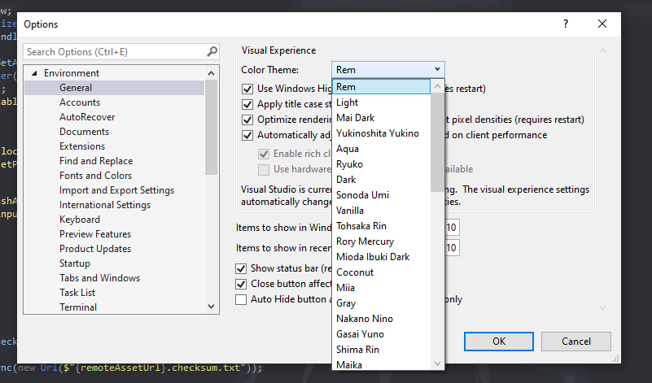
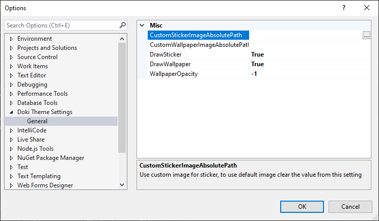
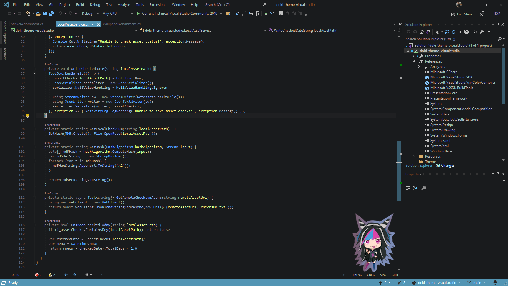
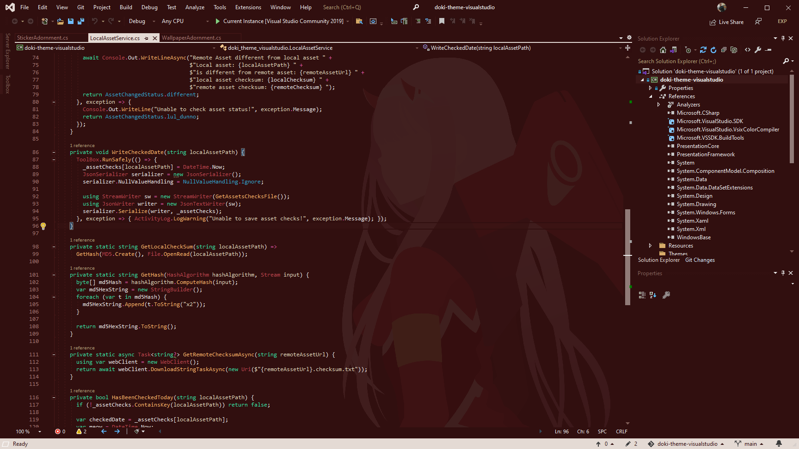
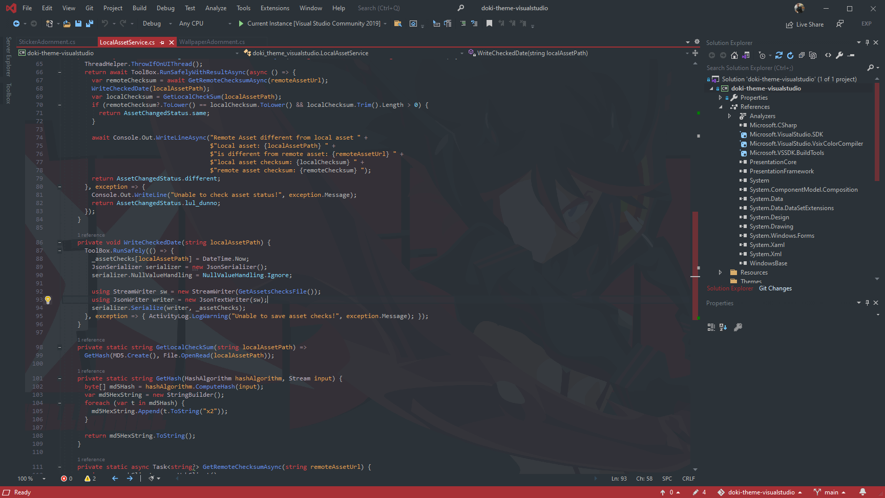
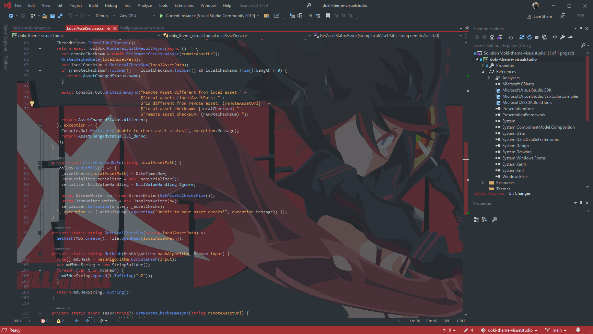

The Doki Theme: Visual Studio
---

## https://doki-theme.unthrottled.io

## Quick Theme Preview

# [More Screenshots](readmeAssets/albums/screenshot_album.md)

## [Changelog](CHANGELOG.md)

---

# Documentation

- [Installation](#installation)
- [Usage](#usage)
  - [Setting Theme](#setting-theme)
  - [Content Settings](#content-settings)
    - [Offline Mode](#offline-mode)
    - [Stickers](#stickers)
    - [Wallpaper](#wallpapers)
  - [Weird Bugs](#weird-bugs)
- [Miscellaneous](#miscellaneous)
    - [Contributing](#contributing) 
    - [Theme Requests](#theme-requests)
    - [Helping the community](#enjoying-the-themes)
    - [Feature Requests](#contributions)

# Installation 

You can find the latest release [at the marketplace](https://marketplace.visualstudio.com/items?itemName=unthrottled.dokithemevisualstudio).

**Visual Studio 2019**: The last supported version for the Visual Studio 2019 platform is [v0.3.0](https://github.com/doki-theme/doki-theme-visualstudio/releases/tag/v0.3.0). You can manually install the vsix file found on the release. For the best experince, please consider upgrading to Visual Studio 2022 and using the [latest version.](https://github.com/doki-theme/doki-theme-visualstudio/releases/latest)

# Usage

You've installed the extension in your Visual Studio now, great!
The following sections should give you an idea of all of the capabilities that the plugin provides.

## Setting Theme

You've got a ton of new themes now! 
To set the look and feel of your IDE, you'll want to navigate to:

<kbd>Tools</kbd> > <kbd>Options</kbd> > <kbd>Environment</kbd> > <kbd>Visual Experience</kbd>

Upon selecting a Doki Theme, your related sticker & wallpaper should be installed as well (provided you have them turned on).

## Content Settings

You get automatic weebification of your IDE with this plugin!
Here's what Otaku related content you can control.

You can navigate to the settings here

<kbd>Tools</kbd> > <kbd>Options</kbd> > <kbd>Doki Theme Settings</kbd> > <kbd>General</kbd>

### Offline Mode

**Important**: An internet connection is required for assets to appear when setting a theme. Assets (sticker & wallpaper) are _not_ bundled with the extension. When a theme is applied, assets are downloaded from a CDN. You only need an internet connection the first time setting a theme. After that, the asset will be available offline.  However, custom assets can be installed without an internet connection.

### Stickers

**DrawSticker**: `true/false`: determines whether the cute little sticker in the right hand corner of your open editor should be rendered.

**CustomStickerImageAbsolutePath**:  You've got your own tastes, that's fine I get that, but you're wrong and I hate you.
That's why I've allowed you to set your own custom sticker to be used for all doki themes. 
The value provided _must_ be an absolute path to the local file on your machine to be used. Feel free to use the `...` to pick a file.

**StickerRelativeSize** because I do not know the Visual Studio SDK very well, this is my solution to fixing issues with zoom scrolling. When the viewport size changes, the sticker would either grow or shrink relative to the viewport. This is the relative size the sticker should be relative to the current view port. 1 being the same size as the viewport and 0.01 being 1 percent the size of the current viewport. 

**Note**: stickers go away if you use a non-Doki Theme.

### Wallpapers

**Important!** This plugin and [ClaudiaIDE](https://github.com/buchizo/ClaudiaIDE) do the same thing for installing wallpapers.
You'll want to either turn off the wallpaper for this plugin or ClaudiaIDE, to avoid unexpected behaviour.

**DrawWallpaper**: `true/false`: determines whether the beautiful wallpaper in the background of your open editor should be rendered.

**CustomWallpaperImageAbsolutePath**:  My taste in wallpapers isn't good enough for you?
Fine be that way, I've allowed you to set your own custom wallpaper to be used for all Doki themes.
The value provided _must_ be an absolute path to the local file on your machine to be used. Feel free to use the `...` to pick a file.

**Note**: wallpapers go away if you use a non-Doki Theme.

**WallpaperAnchor**: controls where the wallpaper is initially positioned relative to the editor background.
`Default` will use the theme defined anchoring. _Note_: All default wallpapers have 16:9 aspect ratio, so this may not have much of an effect for default wallpapers.

**WallpaperFill**: changes how the wallpaper is sized relative to the viewport. 

_Filled_ will maintain the size height of the wallpaper, which tends to cuts the top off.

_Scaled_ will scale the wallpaper to the viewport, so the entire image is visible. Will make the image small!

https://user-images.githubusercontent.com/15972415/143469376-a87ce7ec-452c-4859-9e47-b3ef9f24b7f2.mp4

**WallpaperOffsetX** allows you to move the wallpaper to the left or right in the viewport. Supply a double value in the range of [-1.0,1] to move the wallpaper right (eg: -0.25) or left (0.25)

**WallpaperOffsetY** allows you to move the wallpaper up or down in the viewport. Supply a double value in the range of [-1.0,1] to skew the wallpaper down (eg: -0.25) or up (eg: 0.25).

https://user-images.githubusercontent.com/15972415/143469290-31047487-c788-4d2e-9293-698ffd6850fc.mp4

**WallpaperOpacity** Value Range: `[-1.0, 1]` (eg: 0.5 for half opacity) It looks good on my machine! 
I've carefully picked the various opacity levels for the default wallpapers to look good on my monitors.
However, that might not be the case for yours. 
So you might need to customize the brightness to your liking.

You can always set it back to `-1` and you'll get the default opacity that I picked.

| **WallpaperOpacity**: `-1` | **WallpaperOpacity**: `0.25` |
| --- | --- |
|  |   |

## Weird Bugs

The assets will only show up after the package initializes. This takes a bit longer if a solution is opened instead of the regular launch screen (the one where you you can open a project from). The plugin loads quicker on the launch screen. 

I couldn't figure out how to re-render the window, so the sticker/wallpaper will only show up after scrolling/typing/switching tabs. So just keep coding and your stuff will eventually show up.

https://user-images.githubusercontent.com/15972415/145320920-9492b4d1-ae46-43f2-b65f-1ee7d02c5a19.mp4

# Miscellaneous

## Contributing

If you want to get your workstation set up to work on the plugin,
then you'll want to check out the [CONTRIBUTING.md](./CONTRIBUTING.md) for instructions on what is needed.

## Theme Requests

If you want your main squeeze to be featured in the Doki Theme suite, feel free to [submit a theme request](https://github.com/doki-theme/doki-master-theme/issues).

## Enjoying the themes?

Great! I am glad you like it!

Be sure to ⭐ and share it with other weebs!

## Contributions?

I think your voice needs to be heard! You probably have good ideas, so feel free to submit your feedback as [an issue](https://github.com/doki-theme/doki-theme-visualstudio/issues/new).

Help make this plugin better!

